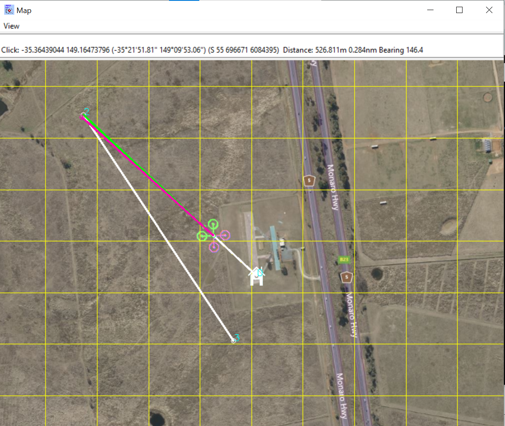
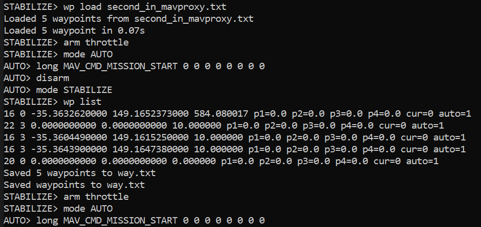

# INTRODUCTION
This guide provides a walkthrough of using MAVProxy, a command-line ground control station (GCS) for drones, to connect, configure, and control vehicles in simulation (SITL). It covers everything from establishing a serial or network connection, understanding MAVLink system and component IDs, arming and disarming the drone, to planning and executing autonomous missions using the mission editor. 
## Serial Connection

A serial connection is a way for two devices (like your computer and a drone’s flight controller) to communicate one bit at a time over a cable.

Common on drones via USB-to-serial adapters.

* On Linux, it shows up as /dev/ttyUSB0, /dev/ttyUSB1, etc.
* On Windows, it shows up as COM3, COM4, etc.

Think of it like sending a stream of data through a very narrow pipe: one bit after another, in a fixed order.

In MAVProxy, a serial connection is used with the ``` --master``` option.

## Baud Rate

The baud rate is the speed of the serial connection. It’s how fast the bits travel through the wire.

* Measured in bits per second (bps).
* Common drone baud rates: 57600, 115200.

```--master=/dev/ttyUSB0 --baudrate=57600```

This tells MAVProxy:

```Use this serial port and communicate at 57600 bits per second.```

Important: Both the drone and the computer must use the same baud rate, otherwise data will be garbled.

#### Analogy:

* Serial connection = a narrow pipe connecting two devices.
* Baud rate = how fast water flows through that pipe. Too fast or too slow = leaks (data errors).

## MAVLink IDs Overview

MAVLink uses IDs to distinguish between multiple devices and components on the same network. Think of it like giving each device and its parts a unique address so messages don’t get mixed up.

### 1. System ID (system_id)

Every vehicle or ground station has a system ID.

Example:
* Drone = 1
* Another drone = 2
* Your GCS = 255 (common default for ground stations)

Purpose: The system ID tells the MAVLink network who is sending or receiving messages.

#### 2. Component ID (component_id)

Each system can have multiple components.

Example components on a drone:

* Autopilot = 1
* Camera = 100
* Gimbal = 200

Example components on a GCS:

* MAVProxy console = 1
* Telemetry interface = 2

Purpose: Identifies which part of the system is sending or receiving the message.

#### 3. How MAVProxy Uses These IDs

* ```--source-system``` → ID of your GCS (so the drone knows who sent a command).

* ```--source-component``` → Which component of the GCS is sending messages.

* ```--target-system ```→ ID of the vehicle/drone you want to control.

* ```--target-component``` → Which component of the vehicle you want to talk to (usually autopilot = 1).

Meaning:

* Connect via serial /dev/ttyUSB0
* GCS system ID = 255, GCS component ID = 1
* Drone system ID = 1, drone component ID = 1 (autopilot)

This ensures that commands go to the right drone and right component, and responses come back to the correct GCS.

#### Analogy:

* System ID = “which device” (like your phone vs your laptop)
* Component ID = “which app or part of the device” (like Messages app vs Camera app)

## Arming and Disarming a drone using MAVProxy:

### 1. Connecting to the Vehicle

```mavproxy.py --master=127.0.0.1:14550 --console --map```


* ```--master=127.0.0.1:14550 ```→ Connects to the vehicle (or simulator) at this IP:PORT.
* ```--console → ```Opens the MAVProxy command-line console for manual commands.
* ```--map ```→ Opens an interactive map showing the drone’s location.

Once connected, you can send commands to the drone.

### 2. Arming the Vehicle

```arm throttle```

* What it does: Turns on the motors and prepares the drone for flight.
* Why it's needed: A drone will not move or respond to throttle until it is armed, as a safety measure.

Important: Only arm the drone when it’s safe to do so (propellers clear, drone on a stable surface).

### 3. Disarming the Vehicle
```disarm```
* What it does: Turns off the motors immediately.
* Why it's needed: For safety, or after landing.

### 4. Automatic Disarm Delay

* If you arm the drone but do nothing, it can automatically disarm after a certain time.
* This time is controlled by the parameter ```DISARM_DELAY```.
* Check the current disarm delay ```param show DISARM_DELAY```

* It Shows the current value (in seconds) of how long the drone waits before auto-disarming.

* Set the disarm delay ```param set DISARM_DELAY 10```

* Sets the auto-disarm delay to 10 seconds.
* Now, if you arm the drone and leave it idle, it will automatically disarm after 10 seconds.

### Summary

* Connect using MAVProxy with --console to type commands.
* Arm the drone with arm throttle → motors start.
* Disarm the drone with disarm → motors stop.
* Auto disarm happens after DISARM_DELAY seconds if no commands are given.

Use ```param show DISARM_DELAY``` and ```param set DISARM_DELAY X``` to view or change this timer.

#### Analogy:

* Arming = turning the engine key ON.
* Disarming = turning the engine key OFF.
```DISARM_DELAY``` = the “automatic engine off timer” if you forget to turn it off manually.

## MISSION EDITOR IN MAVProxy:

### 1. Start MAVProxy

Run the following cmd console: 

```mavproxy.py --master=127.0.0.1:14550 --console --map```

* ```--master=127.0.0.1:14550 ``` → Connects to your vehicle or simulator (SITL).
* ```--console → ```Opens the command-line interface to type MAVProxy commands.
* ```--map``` → Opens an interactive map showing the drone’s location and waypoints.

### 2. Load the Mission Editor Module

Run the cmd: 

```module load misseditor```

Loads the mission editor module, which lets you create, modify, and upload missions to the drone.

### 3. Mission Editor Commands

Here are some useful commands you can use inside MAVProxy with the mission editor loaded:

#### Command	Purpose
| Command | Description |
|---------|-------------|
| `wp clear` | Clears all mission waypoints from MAVProxy (resets the mission list). |
| `wp ftp` | Fetches the mission list from the drone using FTP and saves it to `way.txt`. |
| `wp ftpload FILE_NAME` | Sends a mission file from your computer to the drone using FTP. |
| `wp list` | Fetches and shows the current mission items from the drone. |
| `wp load FILE_NAME` | Loads a mission from a file and sends it to the drone. |
| `wp save FILE_NAME` | Saves the current mission list to a file on your computer. |

### 4. Starting a Mission Without Radio
```long MAV_CMD_MISSION_START 0 0 0 0 0 0 0 0```

This command starts the mission programmatically (without using a physical RC controller).  Typically used in simulators (SITL) for testing autonomous flights.

### 5. Adjusting Simulation Speed

After running a mission in SITL, you may want to return to real-time speed:

```param set SIM_SPEEDUP 1```

```SIM_SPEEDUP``` controls simulation speed.

Setting it to 1 → simulation runs in real-time.

## HOW TO EXECUTE THE MISSION:

After you plan a mission in the mission editor, this the sequence of commands in MAVProxy for executing a mission and then returning to manual control. Let me explain each step in your sequence:

### 1. STABILIZE → arm throttle
```STABILIZE> arm throttle```

* You start in STABILIZE mode (manual control with self-leveling).
* Arming turns on the motors so the drone is ready to fly.

At this point, the drone is powered but still waiting for instructions.

### 2. STABILIZE → mode AUTO
```STABILIZE> mode AUTO```


* Switches the drone into AUTO mode.
* AUTO mode tells the drone to follow the pre-planned mission you uploaded via ```wp load```or ```wp ftpload```

### 3. AUTO → start the mission
```AUTO> long MAV_CMD_MISSION_START 0 0 0 0 0 0 0 0```
* Starts the mission programmatically (useful in SITL or when no RC is available).
The drone will begin flying through the waypoints in order.

### 4. AUTO → mode STABILIZE
```AUTO> mode STABILIZE```

* After mission completion, switching back to STABILIZE gives you manual control again.
* Useful if you want to take over control after autonomous flight.

### 5. STABILIZE

Drone is now in manual mode and you can fly it with RC or GCS commands.

### SEE the screenshots attached

#### MISSION EDITOR


#### FLYING_IN_SITL



#### CONSOLE


