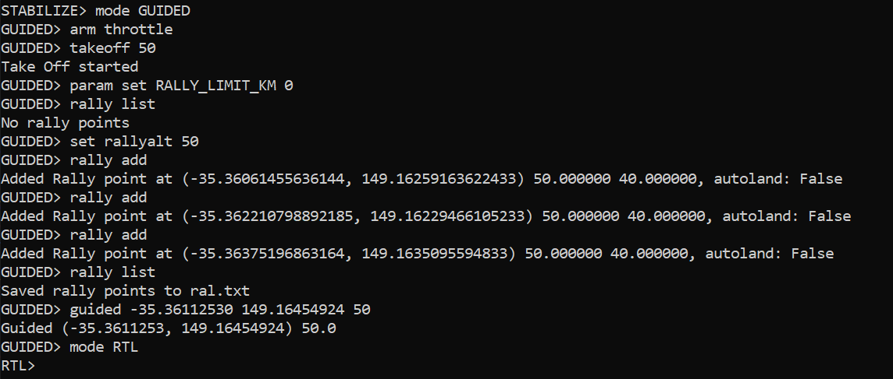
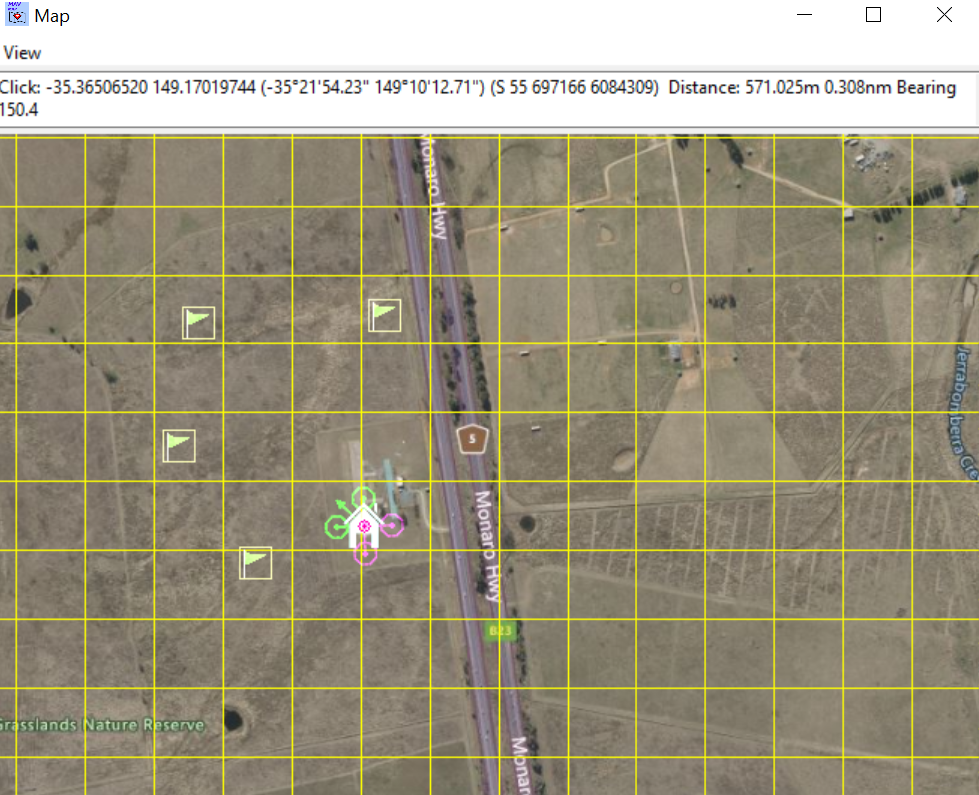
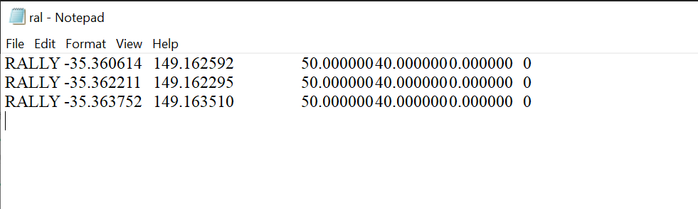

## What are Rally Points?

Normally, when a drone (Plane or Copter) enters Return to Launch (RTL) mode—like when it loses signal, battery is low, or a failsafe triggers—it goes back to the Home point, which is usually the takeoff location.

*Problem:* Sometimes going straight back to Home is not safe or practical:

* Home could be above people, buildings, or restricted areas.
* The drone may be far away, and going all the way back is inefficient or risky.

### Solution: Rally Points

Rally Points are predefined safe locations where the drone can go instead of Home.

* If RTL is triggered and Rally Points exist, the drone will:
  * Go to the closest Rally Point first.
  * Plane: loiters there (hovers or circles).
  * Copter: lands automatically at the Rally Point.

Think of Rally Points like emergency safe landing zones for your drone.

## 2️⃣ Rally Points in MAVProxy

MAVProxy is a command-line tool that lets you control drones and send commands. Here’s how Rally Points are managed there:

Starting MAVProxy with map & console:

```mavproxy.py --master=127.0.0.1:14550 --console --map```

* ```--console:``` enables the command-line interface.

* ```--map: ``` shows a map so you can click to add Rally Points visually.

#### Important Parameter:
```param set RALLY_LIMIT_KM 0```


This tells the drone to always use the closest Rally Point, no matter how far it is.

By default, there may be a limit distance; setting to 0 disables the limit.

### CONSOLE SCREENSHOT (HOW TO USE RALLY POINTS):



## Rally Commands in MAVProxy

| Command                | Function                                                         |
|------------------------|------------------------------------------------------------------|
| `rally list`           | Shows all Rally Points currently stored in the flight controller.|
| `rally load FILE_NAME` | Loads Rally Points from a file into the flight controller.       |
| `rally save FILE_NAME` | Saves the current Rally Points from the flight controller to a file.|
| `rally clear`          | Deletes all Rally Points from the flight controller.             |
| `rally add`            | Adds a Rally Point at a location you click on the map.           |
| `rally remove INDEX`   | Removes a Rally Point at the given index (position in the list). |
| `set rallyalt 50`      | Sets the default altitude for Rally Points (here 50 meters).     |

## How It Works in Flight

You define multiple safe landing points before flight.

If the drone needs to RTL:

* It chooses the nearest Rally Point.
* Moves to it safely.
* Then either loiters (Plane) or lands (Copter).

This increases safety and flexibility, especially for long missions or risky environments.

## Real-World Analogy

Think of a drone as a person in a city:

* Home point: your own house.
* Rally Points: safe hotels or checkpoints along the way.

If something goes wrong, instead of rushing all the way home (which might be dangerous), you go to the nearest safe checkpoint.
## MAP IN MAVPROXY SHOWING RALLY POINTS (GREEN FLAGS)



## SAMPLE RALLY POINTS FILE_NAME
| Index | Latitude    | Longitude    | Altitude (m) | Acceptance Radius (m) | Land Direction | Flags |
|-------|------------|-------------|--------------|---------------------|----------------|-------|
| 1     | -35.360614 | 149.162592  | 50.0         | 40.0                | 0.0            | 0     |
| 2     | -35.362211 | 149.162295  | 50.0         | 40.0                | 0.0            | 0     |
| 3     | -35.363752 | 149.163510  | 50.0         | 40.0                | 0.0            | 0     |



### ✅ Explanation of columns:

* Index – Rally Point number
* Latitude – Decimal degrees
* Longitude – Decimal degrees
* Altitude (m) – Height for the Rally Point
* Acceptance Radius (m) – How close the drone must get to consider the point reached
* Land Direction – Approach angle (0 = default)
* Flags – Additional options (0 = default behavior)