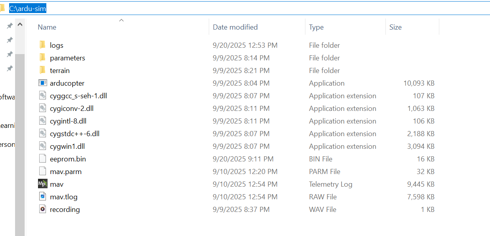

# ArduCopter SITL + MAVProxy — Guide

```Ready-to-paste, step-by-step guide to run ArduCopter SITL on Windows, connect MAVProxy, and forward telemetry to Mission Planner (MP) or QGroundControl (QGC). Includes batch scripts, troubleshooting, and GitHub instructions.```

## Quick overview

```This repository contains a reproducible workflow to run ArduCopter SITL (Software-in-the-Loop) on Windows, control it with MAVProxy and forward telemetry to Mission Planner (or other GCS).```

## Quickstart (steps)

* Put arducopter.exe and parameters/copter.parm into C:\ardu-sim.


## Prerequisites
* Windows 10 / 11 

* Python 3.8+ installed 

* pip available (comes with Python installer)

* Mission Planner (for GUI telemetry) or QGroundControl (optional)

* MAVProxy installed via pip

* ArduCopter SITL binary for Windows (arducopter.exe)

## Download SITL binaries

```Download the Windows SITL binaries and arducopter.exe from the official ArduPilot SITL build site```

``` https://firmware.ardupilot.org/Tools/MissionPlanner/sitl/```

* Search for and download the ArduCopter.elf

```Install the ArduCopter.elf inside C:\ardu-sim. After that change the name of file to arducopter and change the extension to .exe from .elf```

* After installing .dll files , create another folder inside C:\ardu-sim (or whatever teh folder name is ) and name it as parameters.

* Click on this link https://raw.githubusercontent.com/ArduPilot/ardupilot/master/Tools/autotest/default_params/copter.parm , it will show all copter's paramteres. your job is to save this file inside the paramters folder. Don't forget to rename file as copter.parm (when you first save file, it will be saved as copter.parm.txt)


# Install MAVProxy

```Open an regular command prompt if you prefer and run```
* python -m pip install --upgrade pip
* python -m pip install MAVProxy

```Verify installation:```
* python -m pip show MAVProxy
* where mavproxy.py

NOTE: If "where mavproxy.py" returns a path 
* C:\Users\<YourUser>\AppData\Local\Programs\Python\PythonXX\Scripts\)

you can run mavproxy.py globally (if that folder is in PATH) or run it with the full path.


## Screenshots



