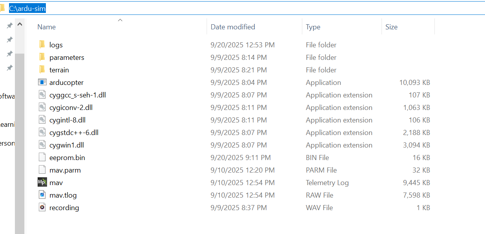

# ArduCopter SITL + MAVProxy — Guide

Ready-to-paste, step-by-step guide to run ArduCopter SITL on Windows, connect MAVProxy, and forward telemetry to Mission Planner (MP) or QGroundControl (QGC). Includes batch scripts, troubleshooting, and GitHub instructions.

## Quick overview

This repository contains a reproducible workflow to run ArduCopter SITL (Software-in-the-Loop) on Windows, control it with MAVProxy and forward telemetry to Mission Planner (or other GCS).

## Quickstart (steps)

* Put arducopter.exe and parameters/copter.parm into C:\ardu-sim.


## Prerequisites
* Windows 10 / 11 

* Python 3.8+ installed 

* pip available (comes with Python installer)

* Mission Planner (for GUI telemetry) or QGroundControl (optional)

* MAVProxy installed via pip

* ArduCopter SITL binary for Windows (arducopter.exe)

## Download SITL binaries

Download the Windows SITL binaries and arducopter.exe from the official ArduPilot SITL build site

``` https://firmware.ardupilot.org/Tools/MissionPlanner/sitl/```

* Search for and download the ArduCopter.elf

Install the ArduCopter.elf inside C:\ardu-sim. After that change the name of file to arducopter and change the extension to .exe from .elf

* After installing .dll files , create another folder inside C:\ardu-sim (or whatever teh folder name is ) and name it as parameters.

* Click on this link https://raw.githubusercontent.com/ArduPilot/ardupilot/master/Tools/autotest/default_params/copter.parm , it will show all copter's paramteres. your job is to save this file inside the paramters folder. Don't forget to rename file as copter.parm (when you first save file, it will be saved as copter.parm.txt)

### Screenshot




## Install MAVProxy

```Open an regular command prompt if you prefer and run```
* python -m pip install --upgrade pip
* python -m pip install MAVProxy

```Verify installation:```
* python -m pip show MAVProxy
* where mavproxy.py

NOTE: If "where mavproxy.py" returns a path 
* C:\Users\<YourUser>\AppData\Local\Programs\Python\PythonXX\Scripts\)

you can run mavproxy.py globally (if that folder is in PATH) or run it with the full path.

## STARTING THE SITL USING MAVPROXY

### 1. Start the SIMUALTOR

 Inisde the folder C:\ardu-sim (or whatever you named the folder), go in the address bar and type cmd, it will open a temrinal inside that terminal , write the following command

* arducopter 

when you run this command it will ask you to specify a vehicle model. Next , run the following command

* arducopter -w -S --model + --speedup 1 --defaults parameters/copter.parm -I0

### Screenshot


```👉 Explanation of flags:```

* -w → wipes/reset parameters to defaults.
* -S → enable SITL console output.
* --model + → selects a simple quadcopter (+ frame).

*--speedup 1 → run simulator at normal speed (1×).

*--defaults parameters/copter.parm → load default parameters from file.

* -I0 → vehicle instance 0 (important if you run multiple drones).

This command launches SITL with a clean setup and quadcopter model.

### 2. Start MAVProxy

First of all clone this repo https://github.com/mustafa-gokce/ardupilot-software-development.git inside another folder (you may name the folder whatever you like). Inside the folder you will find many folders like mavproxy , pymavlink etc.
After that open another terminal and run the command : 
``` mavproxy --master tcp:127.0.0.1:5760 --out 127.0.0.1:14550 --out 127.0.0.1:14560  (you may add python at that start of the command).```


👉 Explanation of arguments:

* --master tcp:127.0.0.1:5760 → Connects MAVProxy to SITL on TCP port 5760.

* --out 127.0.0.1:14550 → Forwards telemetry to a GCS (Mission Planner / QGC).

* --out 127.0.0.1:14560 → Creates an extra output stream (for another GCS, or Python scripts like DroneKit).

So, MAVProxy works like a router between SITL and your ground station software.

### 3. RUN MAVPROXY WITH MAP AND CONSOLE

Run this cmd in the command prompt. This is the MAVproxy relay command: 

* mavproxy.py --master=tcp:127.0.0.1:5760 --console --map 

(you can extend the above cmd to forward telemtery to another GCS like MP , search how to do that)

The above command means:
```“Run MAVProxy using Python, connect it to a vehicle on TCP port 5760 (SITL or real autopilot), show the console for command input, and show a map for visual tracking.”```

Make sure you have following libraries installed. MAVProxy may require specific Python package versions. Install them like this:

```pip install "numpy<2" matplotlib==3.7.2 opencv-python==4.7.0.72 pyparsing==3.0.9```


👉 Explanation:

* numpy<2 → MAVProxy is not yet compatible with NumPy 2.x.

* matplotlib==3.7.2 → stable plotting support.

* opencv-python==4.7.0.72 → used for MAVProxy’s camera/video modules.

* pyparsing==3.0.9 → required by Matplotlib.

## 4. Flying the Drone in SITL (via MAVProxy)

Once you’ve started SITL and connected it through MAVProxy, you can now issue flight commands directly from the MAVProxy console.

### 1. Basic Commands

Inside the MAVProxy console (write all cmds in the command prompt , inside MAVProxy white-colore console you will see whether your cmds got accepted or not), 
type:

```help```

👉 This lists all available commands.

### 2. Arm the Drone

Before takeoff, you must arm the motors:

```arm throttle```


👉 Explanation:

arm → arms the motors.

throttle → allows throttle input so the drone can take off.

### 3. Change Flight Modes

Set the drone’s behavior by changing its flight mode:

* mode stabilize     
* mode guided        
* mode loiter      
* mode rtl           
* mode land          


👉 Explanation:

* stabilize → manual, pilot controls attitude.

* guided → enables programmatic navigation (e.g., “fly to this GPS point”).

* loiter → hover in place with GPS hold.

* rtl → Return-to-Launch (fly home).

* land → land at current location.

### 4. Takeoff

To make the drone take off:

```takeoff 10```


👉 The drone climbs to 10 meters altitude in GUIDED mode.

⚠️ Make sure you are in GUIDED mode before issuing this command:

Follow the sequence

```mode guided```
```arm throttle```
```takeoff 10```

### 5. Guided Navigation (Fly to GPS Point)

Tell the drone to fly to a specific latitude, longitude, and altitude:

```guided <lat> <lon> <alt>```

Example:

```guided 47.397742 8.545594 25```
NOTE: Click on MAVProxy map window , it will show you coordinates, use that cooordinates to fly to that point


👉 Explanation:

* 47.397742 = latitude

* 8.545594 = longitude

* 25 = target altitude (in meters)

The drone will autonomously fly to this location.

### 6. Cancel Midway (Change Mode)

If you want to stop the current mission or action, you may use one of the following:

* mode loiter    
* mode rtl       
* mode land      
* disarm         

👉 disarm in SITL = instant stop (useful for emergencies).


### 8. Monitor Drone Status

You can check status info anytime:

```status```


👉 Shows battery, mode, GPS, altitude, etc.

### 9. Visual Feedback

If you started MAVProxy with --console --map, you’ll see:

* A live console window showing status and logs.

* A live map window with your drone’s position.


